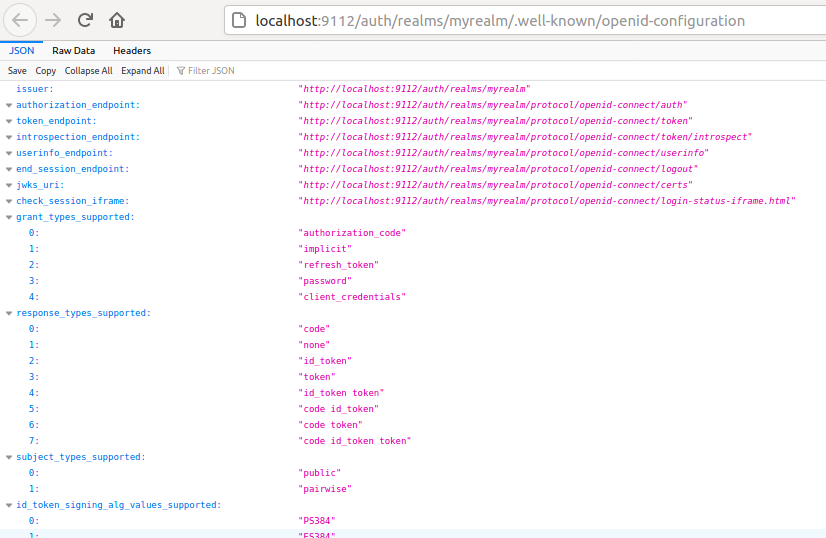

# Replay after Udemy "OAuth2.0 : Nailed the core framework"

The authorization code grant type is used to obtain both access
tokens and refresh tokens and is optimized for confidential clients.


See https://tools.ietf.org/html/rfc6749#section-4.1

## Setup Keycloak on Docker

```
docker run -p 9112:8080 -e KEYCLOAK_USER=admin -e KEYCLOAK_PASSWORD=admin -e TZ=Europe/Vienna quay.io/keycloak/keycloak:11.0.0
docker stop amazing_kapitsa
docker rename amazing_kapitsa keycloak_1
docker start keycloak_1
docker logs -f  --tail 20  keycloak_1
```

The admin interface is then reachable via http://localhost:9112/auth/

## Administer a new Keycloak realm and users

### Realm

- Name: myrealm
- Client: oauth-nailed-app-1
  - Root URL: http://localhost:9110/
  - Valid Redirect URIs: http://localhost:9110/*
  - Admin URL: http://localhost:9110/
  - Web Origins: http://localhost:9110/
- Endpoints: OpenID Endpoint

So that



### User

- Name/PWD: myuser/myuser
- Email Verified: Off

## Starting the OAuth Client

```
joma@edison:oauth2-nailed (master%=) $ cd src/client/
joma@edison:client (master%=) $ go run .
```

The OAuth Client page is then reachable via http://localhost:9110/

It covers the flow of

- A (Authorization Request)
- C (Authorization Response)
- D (Access Token Request)

## References

- https://tools.ietf.org/html/rfc6749 (The OAuth 2.0 Authorization Framework Standard)
  - https://tools.ietf.org/html/rfc6749#section-4.1 (Authorization Code Grant)
- https://github.com/keycloak/keycloak-containers/blob/11.0.0/server/README.md
- https://www.keycloak.org/docs-api/11.0/rest-api/index.html
- https://www.keycloak.org/docs/latest/securing_apps
