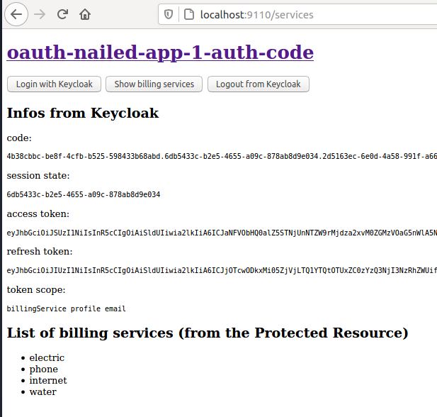
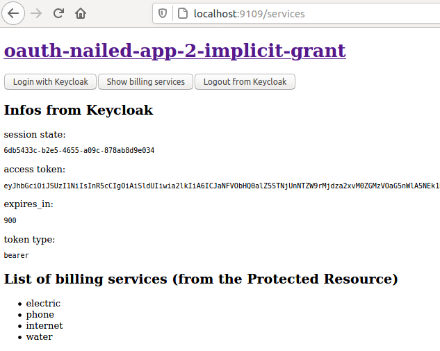
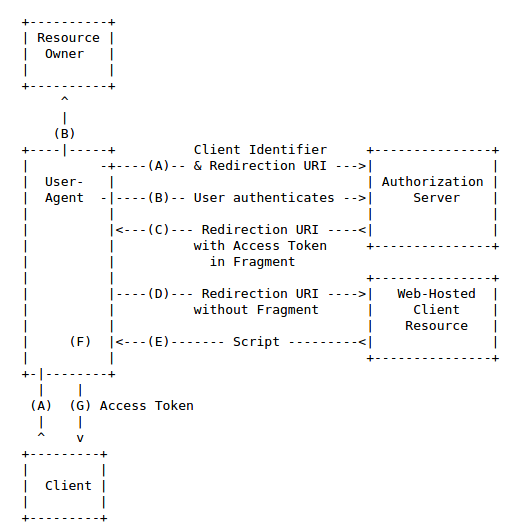
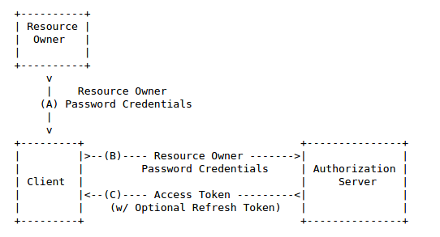
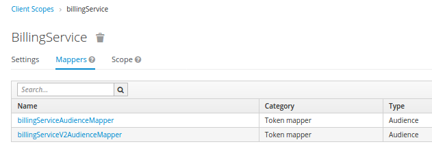
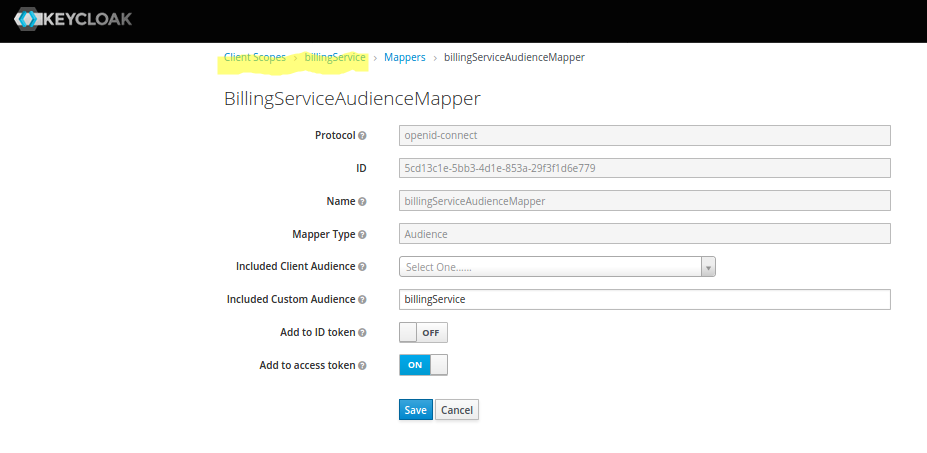
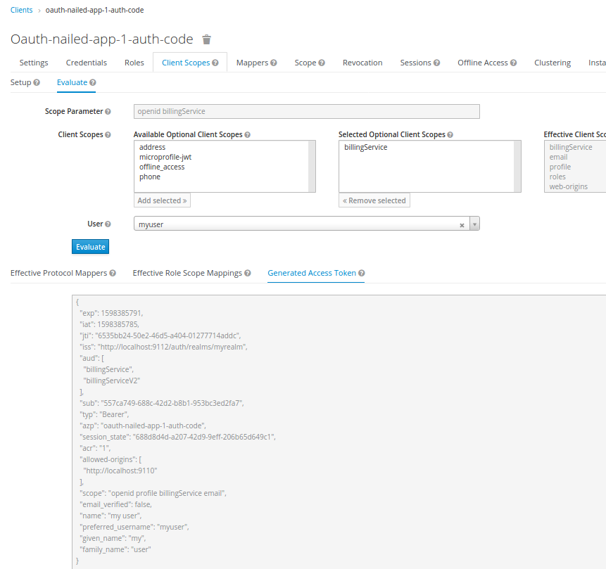
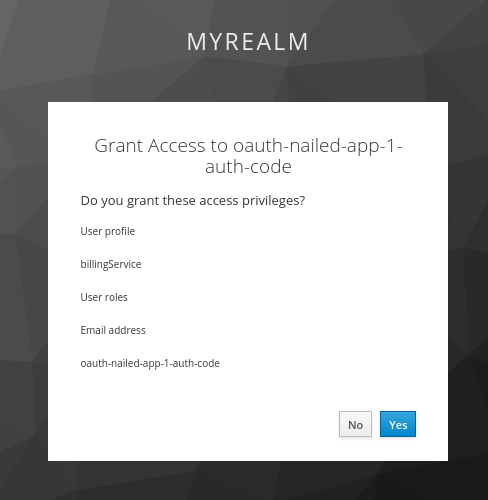
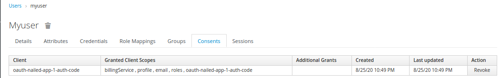

# Replay after Udemy "OAuth2.0 : Nailed the core framework"

See https://www.udemy.com/course/oauth-2-nailed-the-core-framework-with-hands-dirty

## The oauth-nailed-app-1-auth-code UI



## The oauth-nailed-app-2-implicit-grant UI



## Treated OAuth 2.0 Flows

### The Abstract OAuth 2.0 Flow

> The abstract OAuth 2.0 flow illustrated describes the interaction between the four roles.


See https://tools.ietf.org/html/rfc6749#section-1.2

### The Authorization Code Grant

> The authorization code grant type is used to obtain both access
> tokens and refresh tokens and is optimized for confidential clients.
>
> Since this is a redirection-based flow, the client must be capable of
> interacting with the resource owner's user-agent (typically a web
> browser) and capable of receiving incoming requests (via redirection)
> from the authorization server.


See https://tools.ietf.org/html/rfc6749#section-4.1

### The Implicit Grant

> The implicit grant type is used to obtain access tokens (it does not
> support the issuance of refresh tokens) and is optimized for public
> clients known to operate a particular redirection URI. These clients
> are typically implemented in a browser using a scripting language
> such as JavaScript.



See https://tools.ietf.org/html/rfc6749#section-4.2

### The Resource Owner Password Credentials Grant

> The resource owner password credentials grant type is suitable in
> cases where the resource owner has a trust relationship with the
> client, such as the device operating system or a highly privileged
> application.
>
> This grant type is suitable for clients capable of obtaining the
> resource owner's credentials (username and password, typically using
> an interactive form). It is also used to migrate existing clients
> using direct authentication schemes such as HTTP Basic or Digest
> authentication to OAuth by converting the stored credentials to an
> access token.

 This grant type is suitable for clients capable of obtaining the resource owner's credentials" width="700" height="auto" />

See https://tools.ietf.org/html/rfc6749#section-4.3

## Setup Keycloak on Docker

```
docker run -p 9112:8080 -e KEYCLOAK_USER=admin -e KEYCLOAK_PASSWORD=admin -e TZ=Europe/Vienna quay.io/keycloak/keycloak:11.0.0
docker stop amazing_kapitsa
docker rename amazing_kapitsa keycloak_1
docker start keycloak_1
docker logs -f  --tail 20  keycloak_1
```

The admin interface is then reachable via http://localhost:9112/auth/

## Administer Keycloak

### Configure Realm

- Name: myrealm

- Client: oauth-nailed-app-1-auth-code

  - Root URL: http://localhost:9110/
  - Client Protocol: openid-connect
  - Access Type: confidental
  - Valid Redirect URIs: http://localhost:9110/authCodeRedirect
  - Access Token Lifespan: 1 minute (Advanced settings, to check refresh token)
  - Consent Required: on
  - Display Client On Consent Screen: on

- Client: oauth-nailed-app-1-token-checker

  - Client Protocol: openid-connect
  - Access Type: bearer-only

- Client: oauth-nailed-app-2-implicit-grant

  - Root URL: http://localhost:9109
  - Client Protocol: openid-connect
  - Access Type: public
  - Valid Redirect URIs: http://localhost:9109/authCodeRedirect

So that


### Manage User

- Name/Pwd: myuser/myuser
- Email Verified: Off

### Setup Client Scope

Add new client scope

- Name: billingService
- Name: billingServiceV2

Add scope billingService and billingServiceV2 to Client Scopes of clients

- oauth-nailed-app-1-auth-code (Optional)
- oauth-nailed-app-2-implicit-grant (Optional)

### Setup Scope

- oauth-nailed-app-1-auth-code
  - Full Scope Allowed: OFF

### Setup billingService and billingServiceV2 Audience Mapper





### Check generated token includes output of the above billingService and billingServiceV2 Audience Mapper



### Consents in Keycloak

Grant consent screen



Administer consent revocation via Keycloak



## Starting the OAuth Auth Code Client

```
cd src/client/
go run .
```

The OAuth Auth Code Client page is then reachable via http://localhost:9110/

It covers the flow of

- A (Authorization Request, 4.1.1)
- C (Authorization Response, 4.1.2)
- D (Access Token Request, 4.1.3)
- E (Access Token Response, 4.1.4)

* E (Accessing Protected Resources, 7.)
* F (Accessing Protected Resources, 7.)

_The numbers reference the related section in https://tools.ietf.org/html/rfc6749_

## Starting the OAuth Protected Resource

```
cd src/billingservice/
go run .
```

It covers the flow of

- E (Accessing Protected Resources, 7.)
- F (Accessing Protected Resources, 7.)

_The numbers reference the related section in https://tools.ietf.org/html/rfc6749_

## Starting the OAuth Implicit Grant Client

```
cd src/implicit-client
yarn start
```

The OAuth Implicit Grant Client page is then reachable via http://localhost:9109

It covers the flow of

- A (Authorization Request, 4.2.1)
- C (Access Token Response, 4.2.2)

_The numbers reference the related section in https://tools.ietf.org/html/rfc6749#section-4.2_

## References

### ietf rfc\* Standards

- https://tools.ietf.org/html/rfc6749 (The OAuth 2.0 Authorization Framework Standard)
  - https://tools.ietf.org/html/rfc6749#section-4.1 (Authorization Code Grant)
  - https://tools.ietf.org/html/rfc6749#section-7 (Accessing Protected Resources)
  - https://tools.ietf.org/html/rfc6749#section-4.2 (Implicit Grant)
  - https://tools.ietf.org/html/rfc6749#section-4.3 (Resource Owner Password Credentials Grant)
  - https://tools.ietf.org/html/rfc6749#section-1.5 (Refresh Token)
    - https://tools.ietf.org/html/rfc6749#section-6 (Refreshing an Access Token)
- https://tools.ietf.org/html/rfc6750 (The OAuth 2.0 Bearer Token Usage)
- https://tools.ietf.org/html/rfc7519 (JSON Web Token (JWT))
  - https://tools.ietf.org/html/rfc7519#section-7.2 (Validating a JWT)
- https://tools.ietf.org/html/rfc7662 (OAuth 2.0 Token Introspection)
- https://tools.ietf.org/html/rfc7662#section-2.1 (Introspection Request)

### OpenID Connect

- https://openid.net/specs/openid-connect-core-1_0.html (OpenID Connect Core 1.0)
  - https://openid.net/specs/openid-connect-core-1_0.html#Terminology (Terminology like Authentication, Claim etc.)
  - https://openid.net/specs/openid-connect-core-1_0.html#IDToken (Claims aka fields of an ID token aka JWT)

### Keycloak

- https://github.com/keycloak/keycloak-containers/blob/11.0.0/server/README.md
- https://www.keycloak.org/docs-api/11.0/rest-api/index.html
- https://www.keycloak.org/docs/latest/securing_apps
- https://www.keycloak.org/docs/latest/authorization_services/#obtaining-information-about-an-rpt (Token Introspection by Keycloak)
- https://www.keycloak.org/docs/latest/securing_apps/#_token_introspection_endpoint (Introspection Endpoint by Keycloak)

## Tooling

### Diverse

- http://json2struct.mervine.net (Derive a Go struct type from a Json instance)
- https://jwt.io/ (Inspect JWT token)
- https://reactrouter.com/web/guides/quick-start (Router in React)
- https://developer.mozilla.org/en-US/docs/Web/HTTP/CORS (Cross-Origin Resource Sharing (CORS))

### Go

Setup

```bash
joma@edison:oauth2-nailed (master*=) $ GOPATH=$(go env GOPATH)
joma@edison:oauth2-nailed (master*=) $ tree -L 2 $GOPATH
/home/joma/go
├── bin
│   ├── dlv
│   ├── fillstruct
│   ├── gocode
│   ├── gocode-gomod
│   ├── godef
│   ├── godoctor
│   ├── goimports
│   ├── golint
│   ├── gomodifytags
│   ├── go-outline
│   ├── gopkgs
│   ├── goplay
│   ├── gorename
│   ├── goreturns
│   ├── go-symbols
│   ├── gotests
│   ├── guru
│   └── impl
├── pkg
│   ├── linux_amd64
│   └── mod
└── src
    ├── github.com
    └── golang.org

7 directories, 18 files
```

Install a module

```bash
joma@edison:oauth2-nailed (master*=) $ cd src/client/
joma@edison:client (master*=) $ go get github.com/google/uuid
go: finding github.com/google/uuid v1.1.1
go: downloading github.com/google/uuid v1.1.1
```
